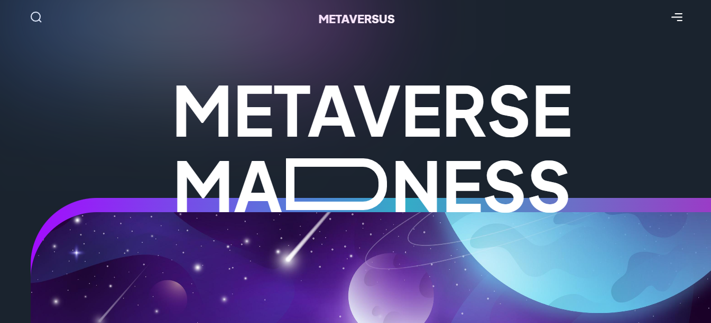
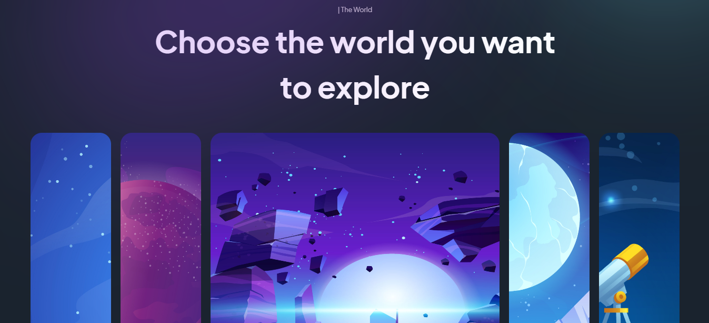
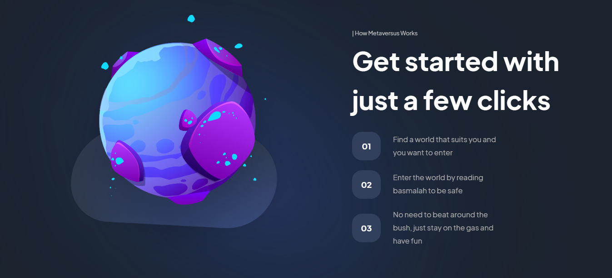
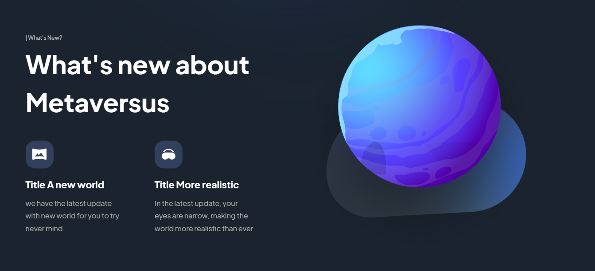
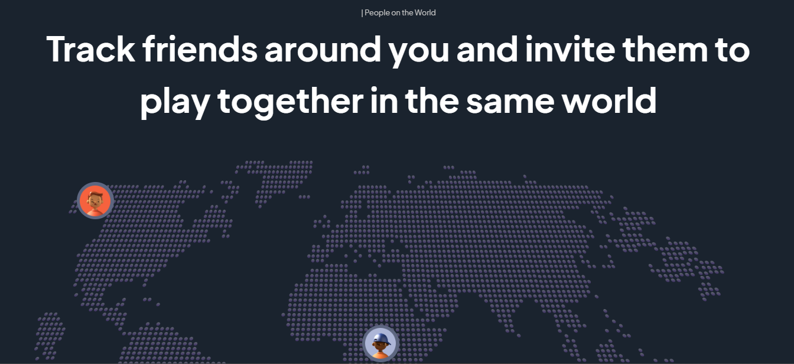
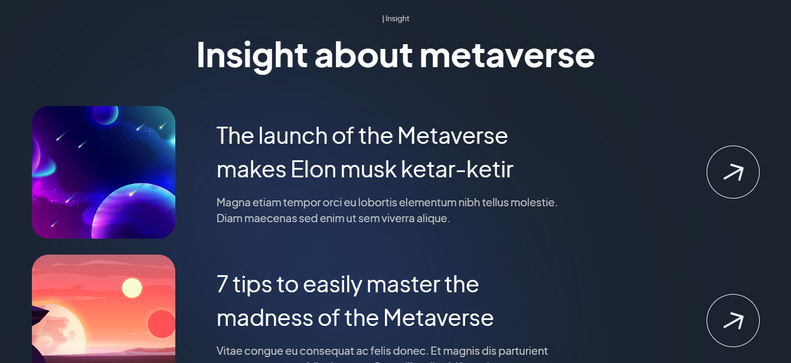
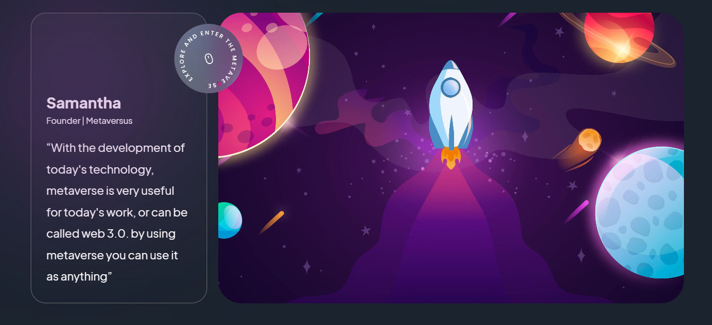

# Metaversus

This project is made with Next.js, Tailwind CSS and Framer Motion

## Demo

[https://metaversus-eme-hache.vercel.app/](https://metaversus-eme-hache.vercel.app/)

## Local development

1. Clone the repository
2. Open a console in the repository folder
3. Run `npm install`
4. Finally, execute `npm run dev`
5. Go to `localhost:3000`  in your browser

## Screenshot

  
  
  
  
  
  
  
  

